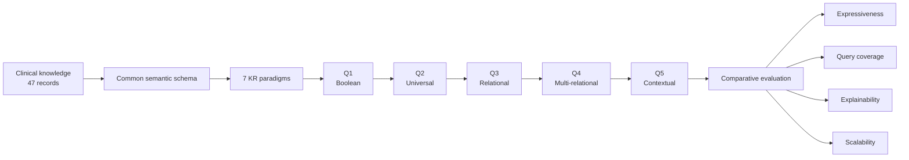

# Healthcare Knowledge Representation: Comparative Evaluation

[](https://doi.org/10.1007/978-3-032-24807-7_4)
[](https://doi.org/10.1007/978-3-032-24807-7_4)
[](https://doi.org/10.1007/978-3-032-24807-7_4)

> **A data-free research companion to a published comparative study of knowledge-representation paradigms for healthcare question answering.**

**Knowledge Representation for Healthcare Systems: A Comparative Analysis of Performance of Different Representation Paradigms**  
**Atul Kumar Tripathi · Puja Minodji Thakre · Niladri Chatterjee**  
*Intelligent Computing: Proceedings of the 2026 Computing Conference*, Lecture Notes in Networks and Information Systems, Vol. 1950, pp. 38–54, Springer, 2026.

**DOI:** [10.1007/978-3-032-24807-7_4](https://doi.org/10.1007/978-3-032-24807-7_4)

---

## Why this repository exists

The paper studies a simple but important question:

> **How does the choice of knowledge representation affect what a healthcare question-answering system can represent, answer, and explain as query complexity increases?**

Instead of treating each representation in isolation, the study places seven paradigms under a shared evaluation framework and progressively challenges them with five clinical query types.

This repository focuses on the **comparative analysis and evaluation logic** behind the paper. It intentionally does **not** redistribute the underlying patient-level dataset or the publisher-formatted article.

---

## At a Glance

| Study element | Summary |
|---|---|
| **Domain** | Healthcare question answering |
| **KR paradigms** | 7 |
| **Clinical records** | 47 anonymized cardiovascular patient records |
| **Benchmark queries** | 5 |
| **Evaluation dimensions** | Semantic expressiveness · Query coverage · Explainability · Scalability |
| **Reasoning progression** | Boolean → universal → relational → multi-relational → contextual |
| **Main published finding** | Knowledge Graphs answered all five benchmark query types and supported multi-hop, contextual, and path-based reasoning |

The paper describes the benchmark as a curated set of 47 anonymized cardiovascular patient records and five progressively complex queries.

---

## Research Map



The five-query progression and the four evaluation dimensions are taken from the study methodology.


---

## Seven Representation Paradigms

| Paradigm | Role in the comparison |
|---|---|
| **Propositional Logic** | Boolean facts and implications over patient attributes |
| **First-Order Predicate Logic** | Variables and quantified relational statements |
| **Rule-Based Systems** | IF–THEN rules with explicit inference traces |
| **Relational Databases** | Structured tabular representation queried with SQL |
| **Frame-Based Systems** | Slot–filler structures with attributes and inheritance |
| **Ontologies (OWL)** | Classes, hierarchy, constraints, and semantic inference |
| **Knowledge Graphs** | Nodes and relations supporting graph traversal and contextual integration |

The published methodology maps these paradigms to lightweight implementations including Python, SQLite, JSON, RDF/OWL, RDFLib, OWL-RL, and SPARQL.

---

## The Benchmark: Five Levels of Reasoning

<details>
<summary><strong>Q1 — Boolean</strong></summary>

Tests direct Boolean reasoning over patient attributes.

</details>

<details>
<summary><strong>Q2 — Universal</strong></summary>

Introduces quantified reasoning over patients satisfying specified conditions.

</details>

<details>
<summary><strong>Q3 — Relational</strong></summary>

Combines multiple patient attributes to derive clinically meaningful relations.

</details>

<details>
<summary><strong>Q4 — Multi-relational</strong></summary>

Requires reasoning across several clinically relevant relations, comorbidities, and guideline information.

</details>

<details>
<summary><strong>Q5 — Contextual</strong></summary>

Pushes the representation toward contextual reasoning that links patient information with broader knowledge sources.

</details>

The paper explicitly defines Q1–Q5 in this progression and uses them to stress the expressive limits of each paradigm.

---

## Evaluation Framework

### 01 · Semantic Expressiveness

How effectively can a representation encode hierarchical, relational, and contextual clinical knowledge?

### 02 · Query Coverage

How many of the benchmark query types can the representation answer successfully?

### 03 · Explainability

Can the system expose an understandable reasoning trace, such as rules, query results, or graph paths?

### 04 · Scalability

How readily can the representation extend to larger datasets and increasingly complex reasoning tasks?

The paper defines these as the central dimensions of the comparative evaluation.

---

## Selected Findings

<details open>
<summary><strong>Query coverage</strong></summary>

The published evaluation reports that **Knowledge Graphs achieved full coverage across Q1–Q5**. Classical approaches showed narrower capabilities as the reasoning requirement became more relational and contextual.

</details>

<details>
<summary><strong>Reasoning depth</strong></summary>

The study treats reasoning depth as the number of intermediate inference steps needed to derive an answer. For graph reasoning, it is expressed through the shortest valid inference path supporting a query.

</details>

<details>
<summary><strong>Explainability</strong></summary>

Rule-based approaches provide explicit derivations, while Knowledge Graphs provide path-based traces that connect entities and relations used in an answer.

</details>

<details>
<summary><strong>Comparative interpretation</strong></summary>

The paper reports a progression in which simpler formalisms remain useful for direct reasoning, while richer semantic connectivity becomes important for multi-relational and contextual questions.

</details>

The published conclusion states that Knowledge Graphs addressed all five benchmark query types, with multi-hop reasoning, contextual integration, and path-based explainability.

---

## Puja Minodji Thakre — Research Contribution

Puja's role in the project was primarily **analytical and evaluative** rather than simply duplicating the implementation work.

Her main contributions included:

- **Statistical and comparative data analysis** of the study outputs.
- **Query-coverage comparison** across the representation paradigms and reasoning levels.
- **Synthesis and interpretation of comparative findings** in relation to the evaluation framework.
- **Manuscript review and refinement** after the initial draft.

This repository therefore places particular emphasis on the **evaluation layer** of the study: how representational choices translate into differences in query coverage, reasoning depth, and explainability.

---

## Co-author Contributions

| Author | Contribution focus |
|---|---|
| **Atul Kumar Tripathi** | Framework development, benchmark construction, prototype implementation, and study integration |
| **Puja Minodji Thakre** | Statistical/data analysis, query-coverage comparison, comparative interpretation, and manuscript review/refinement |
| **Niladri Chatterjee** | Research supervision and academic guidance |

These descriptions are scoped to this project and are not intended to imply exclusive ownership of jointly developed work.

---

## Implementation Overview

The published study reports the following implementation mapping:

```text
Propositional Logic     → Python
Rule-Based Systems      → Python
FOPL / quantified logic → SQLite-based relational simulation
Frame-Based Systems     → Slot–filler JSON structures
Ontologies              → RDF / OWL + RDFLib + OWL-RL
Knowledge Graphs        → RDF triple stores + SPARQL
```

The implementations used a shared cardiovascular knowledge schema to support a controlled comparison.

---

## Research Outputs

**Published article**  
Tripathi, A. K.; Thakre, P. M.; Chatterjee, N.  
*Knowledge Representation for Healthcare Systems: A Comparative Analysis of Performance of Different Representation Paradigms.*  
Springer, 2026, LNNS 1950, pp. 38–54.

**DOI:** [10.1007/978-3-032-24807-7_4](https://doi.org/10.1007/978-3-032-24807-7_4)

---

## Responsible Data & Reproducibility Boundary

This repository deliberately **does not contain**:

- the 47 patient records;
- patient-level attributes or clinical data;
- private collaboration files;
- the publisher-formatted Springer PDF.

The public materials document the methodology, benchmark structure, evaluation dimensions, contribution roles, and published findings. A complete reproduction of the original experiments would require the underlying data and implementation artefacts that are not distributed here.

See [`NOTICE.md`](NOTICE.md) and [`docs/REPRODUCIBILITY.md`](docs/REPRODUCIBILITY.md).

---

## Repository Guide

| File | Purpose |
|---|---|
| [`docs/METHODOLOGY.md`](docs/METHODOLOGY.md) | Study design and implementation mapping |
| [`docs/EVALUATION_FRAMEWORK.md`](docs/EVALUATION_FRAMEWORK.md) | Query coverage, reasoning depth, explainability, and scalability |
| [`docs/CONTRIBUTIONS.md`](docs/CONTRIBUTIONS.md) | Author contribution summary |
| [`docs/REPRODUCIBILITY.md`](docs/REPRODUCIBILITY.md) | What can and cannot be reproduced from the public repository |
| [`analysis/EVALUATION_SCHEMA.csv`](analysis/EVALUATION_SCHEMA.csv) | Machine-readable summary of evaluation dimensions |
| [`CITATION.cff`](CITATION.cff) | Citation metadata for the paper |

---

## Citation

```bibtex
@inproceedings{tripathi2026knowledge,
  title     = {Knowledge Representation for Healthcare Systems: A Comparative Analysis of Performance of Different Representation Paradigms},
  author    = {Tripathi, Atul Kumar and Thakre, Puja Minodji and Chatterjee, Niladri},
  booktitle = {Intelligent Computing: Proceedings of the 2026 Computing Conference},
  series    = {Lecture Notes in Networks and Information Systems},
  volume    = {1950},
  pages     = {38--54},
  publisher = {Springer},
  year      = {2026},
  doi       = {10.1007/978-3-032-24807-7_4}
}
```

---

## Related Profiles

- **Puja Minodji Thakre** — add final academic website, LinkedIn, Google Scholar, and ORCID links when desired.
- **Atul Kumar Tripathi** — [GitHub](https://github.com/atul-k-tripathi)
- **Publication** — [Springer DOI](https://doi.org/10.1007/978-3-032-24807-7_4)

---

> **The useful question is not only what a representation can store, but what it lets a system reason over—and how clearly that reasoning can be followed.**
