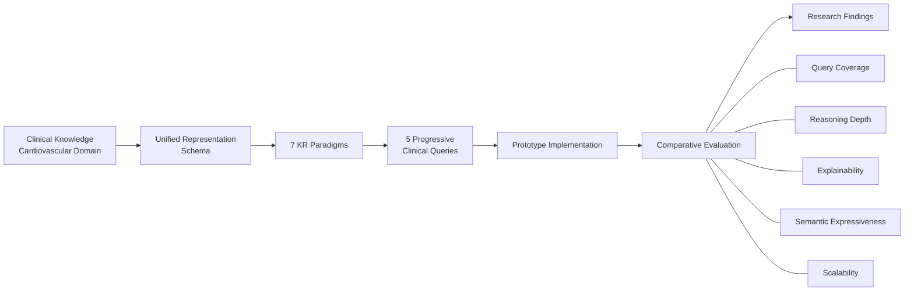

# Healthcare Knowledge Representation: Comparative Evaluation

[](https://doi.org/10.1007/978-3-032-24807-7_4)
[](https://doi.org/10.1007/978-3-032-24807-7_4)
[](#)
[](#)

> **A comparative empirical study of knowledge-representation paradigms for healthcare question answering, with particular attention to query coverage, reasoning depth, semantic expressiveness, explainability, and scalability.**

---

## Overview

Healthcare question answering requires more than retrieving isolated facts. Clinical queries may involve Boolean conditions, quantified statements, relationships among patient attributes, multiple interacting entities, and context drawn from external knowledge.

This study investigates how the choice of **Knowledge Representation (KR)** paradigm affects the ability of an intelligent system to answer such questions.

Seven representation approaches were examined within a common healthcare evaluation framework:

**Propositional Logic · First-Order Predicate Logic · Rule-Based Systems · Relational Databases · Frame-Based Systems · Ontologies · Knowledge Graphs**

The comparison was grounded in a curated cardiovascular benchmark of **47 anonymized patient records** and **five clinical queries** designed to increase progressively in reasoning complexity.

The study was published in the Springer proceedings of the **2026 Computing Conference**.  
[**Read the publication →**](https://doi.org/10.1007/978-3-032-24807-7_4)

---

## Research Question

> **How does the choice of knowledge representation technique influence the reasoning performance and answer quality of expert systems in the healthcare domain?**

The study addresses this question by evaluating multiple paradigms under a unified schema and progressively more demanding clinical queries.

---

## Evaluation Framework

The study evaluates each representation paradigm along four major dimensions:

| Dimension | What it examines |
|---|---|
| **Semantic Expressiveness** | Ability to represent hierarchical, relational, and contextual medical knowledge |
| **Query Coverage** | Number and type of benchmark queries that can be answered successfully |
| **Explainability** | Transparency of the reasoning process and availability of interpretable traces |
| **Scalability** | Ability to accommodate larger datasets and increasingly complex reasoning tasks |

### Reasoning Depth

**Reasoning depth** captures the number of inferential steps required to derive an answer from the available knowledge.

For graph-based reasoning, the study defines it as the **minimum length of a valid reasoning path** that supports a query:

$$
RD(q)=\min_{p\in P(q)} |p|
$$

where:

- \(P(q)\) is the set of valid reasoning paths supporting query \(q\)
- \(|p|\) is the length of a reasoning path \(p\)

Thus, **smaller values indicate shallower reasoning**, while larger values correspond to deeper multi-step inference.

## Research Pipeline



The underlying clinical knowledge was aligned across the paradigms to reduce representational bias.

---

## Benchmark Design

The benchmark contains **47 anonymized cardiovascular patient records** with attributes including patient identifiers, age, gender, chest pain, and selected comorbidities such as hypertension, diabetes, and arrhythmia.

The five queries were deliberately designed to move from simple Boolean reasoning toward relational, multi-relational, and contextual reasoning.

### Q1 — Boolean

> **“Is a patient at risk of heart disease if chest pain is present and smoking history is negative?”**

**Reasoning level:** Boolean conditions

---

### Q2 — Universal

> **“Are all patients over 60 years old with hypertension at elevated risk of cardiovascular disease?”**

**Reasoning level:** Universal / quantified reasoning

---

### Q3 — Relational

> **“What are the cardiovascular risks for patients with both diabetes and obesity?”**

**Reasoning level:** Relational reasoning across patient attributes

---

### Q4 — Multi-relational

> **“Which treatment guidelines are applicable for diabetic patients with left ventricular hypertrophy and a history of atrial fibrillation?”**

**Reasoning level:** Multi-relational reasoning across comorbidities, patient history, and treatment guidance

---

### Q5 — Contextual

> **“Suggest interventions for patients with comorbidities similar to those reported in recent literature.”**

**Reasoning level:** Contextual reasoning and integration of heterogeneous knowledge

---

## Implementation

Lightweight expert-system prototypes were developed for each representation paradigm using a shared cardiovascular schema.

| Paradigm | Implementation approach |
|---|---|
| **Propositional Logic** | Python-based logical conditions |
| **First-Order Predicate Logic** | Relational-query simulation |
| **Rule-Based Systems** | Python rule execution |
| **Relational Databases** | SQLite / SQL queries |
| **Frame-Based Systems** | Slot–filler JSON structures |
| **Ontologies** | RDF / OWL with RDFLib and OWL-RL |
| **Knowledge Graphs** | RDF triple stores with SPARQL queries |

The implementations were intentionally lightweight so that the comparison focused on representational and reasoning capabilities rather than differences in software infrastructure.

---

## Comparative Results

Within the benchmark used in the study, the paradigms showed clear differences as query complexity increased.

### Query Coverage

- **Propositional and rule-based approaches** were effective for simpler Boolean or explicitly encoded reasoning.
- **Relational databases** extended the range of structured querying but remained limited in semantic and hierarchical reasoning.
- **Frame-based representations** captured structured entity relationships but did not adequately support more complex multi-relational inference.
- **Ontologies** enabled deeper reasoning through subclass relationships and formal semantics, but remained limited for contextual and dynamically connected queries.
- **Knowledge Graphs** were the **only paradigm reported as successfully answering all five benchmark queries**, including the multi-relational and contextual cases.

### Reasoning and Explainability

The study also found a progression from shallow rule traces and direct query results toward deeper graph-based reasoning.

Knowledge Graphs supported:

- **multi-hop reasoning**
- **contextual integration**
- **path-based explanation**
- richer connections among heterogeneous entities and relations

These capabilities were particularly relevant to the more demanding benchmark queries.

---

## Why Query Coverage Matters

A central part of the comparative analysis is **query coverage**: whether a representation can actually support a given class of question.

The benchmark therefore moves from:

**Boolean → Quantified → Relational → Multi-relational → Contextual**

This makes it possible to observe where a representation begins to lose expressive or inferential capability instead of evaluating each paradigm only on a single, isolated task.

---

## Contribution Perspective

This repository represents a collaborative research project.

### Puja Minodji Thakre
Puja's contribution primarily focused on the **comparative and analytical side of the study**, including:

- statistical and comparative analysis of evaluation outcomes
- analysis of **query coverage across representation paradigms**
- interpretation of comparative results
- review and refinement of the manuscript through revision stages

### Atul Kumar Tripathi
Atul's contribution included development of the comparative framework, benchmark construction, and implementation-oriented components of the study.

### Niladri Chatterjee
Research supervision and academic guidance.

> The contribution summary above reflects the collaborators' working roles and is intended to describe the research process; the published article does not contain a formal CRediT-style author-contribution statement.

---

## Key Takeaways

The study provides an empirical comparison of classical and graph-based approaches to knowledge representation in healthcare question answering.

Within the experimental benchmark:

1. **Query complexity strongly affected the suitability of a representation paradigm.**
2. Classical approaches remained useful for **simpler and explicitly structured reasoning tasks**.
3. **Knowledge Graphs achieved full benchmark query coverage**, including multi-hop and contextual cases.
4. Greater expressive and reasoning capability came with additional modelling and computational requirements.
5. The findings highlight the importance of evaluating KR systems not only on data storage or retrieval, but also on **reasoning depth, coverage, and explainability**.

---

## Limitations

The study should be interpreted in light of several methodological limitations:

- The benchmark contains only **47 curated cardiovascular patient records**, which limits generalizability.
- Propositional and first-order reasoning were **simulated** using Python conditionals and SQL rather than dedicated logic engines.
- Ontology and Knowledge Graph subclass relationships were manually curated.
- The benchmark is intentionally compact and designed for comparative analysis rather than clinical deployment.

These limitations motivate future evaluation on larger clinical corpora and with more automated ontology-alignment and knowledge-construction pipelines.

---

## Research Context

This work sits at the intersection of:

`Knowledge Representation`

`Knowledge Graphs`

`Healthcare Question Answering`

`Explainable AI`

`Semantic Web`

`Machine Learning`

`Structured Knowledge`

`Intelligent Information Systems`

---

## Publication

**Tripathi, Atul Kumar; Thakre, Puja Minodji; Chatterjee, Niladri.**

**Knowledge Representation for Healthcare Systems: A Comparative Analysis of Performance of Different Representation Paradigms**

*Intelligent Computing: Proceedings of the 2026 Computing Conference, Volume 2*

Lecture Notes in Networks and Systems, Vol. 1950, pp. 38–54, Springer, 2026.

**DOI:** https://doi.org/10.1007/978-3-032-24807-7_4

---

## Citation

```bibtex
@inproceedings{tripathi2026knowledge,
  author    = {Tripathi, Atul Kumar and Thakre, Puja Minodji and Chatterjee, Niladri},
  title     = {Knowledge Representation for Healthcare Systems:
               A Comparative Analysis of Performance of Different
               Representation Paradigms},
  booktitle = {Intelligent Computing:
               Proceedings of the 2026 Computing Conference},
  series    = {Lecture Notes in Networks and Information Systems},
  volume    = {1950},
  pages     = {38--54},
  year      = {2026},
  publisher = {Springer},
  doi       = {10.1007/978-3-032-24807-7_4}
}
```

---

## Data & Reproducibility

This repository **does not contain the patient-level dataset** used in the study.

No patient records, personally identifiable information, or restricted clinical material are included here.

The repository instead documents:

- the research question
- benchmark design
- exact clinical queries
- representation paradigms
- evaluation dimensions
- comparative interpretation
- publication metadata

This keeps the repository informative while respecting the data and publication constraints associated with the research.

---

## Repository Structure

```text
healthcare-kb-representation-evaluation/
│
├── README.md
├── CITATION.cff
├── NOTICE.md
├── REPOSITORY_MAP.md
│
├── docs/
│   ├── METHODOLOGY.md
│   ├── EVALUATION_FRAMEWORK.md
│   ├── CONTRIBUTIONS.md
│   └── REPRODUCIBILITY.md
│
└── analysis/
    └── EVALUATION_SCHEMA.csv
```

---

## Links

**Publication:**  
https://doi.org/10.1007/978-3-032-24807-7_4

**Google Scholar:**  
https://scholar.google.com/citations?user=FoOvhlQAAAAJ&hl=en&authuser=6

**ORCID:**  
https://orcid.org/my-orcid?orcid=0009-0001-7924-5363

**Academic Website:**  
_Add academic website_

**LinkedIn:**  
https://www.linkedin.com/in/puja-minodji-thakre/?lipi=urn%3Ali%3Apage%3Ad_flagship3_profile_view_base_contact_details%3BczT2VDfOR5KKgP2CFp4%2BpQ%3D%3D

---

> **From representation to reasoning: the structure of knowledge shapes the questions an intelligent system can answer.**
