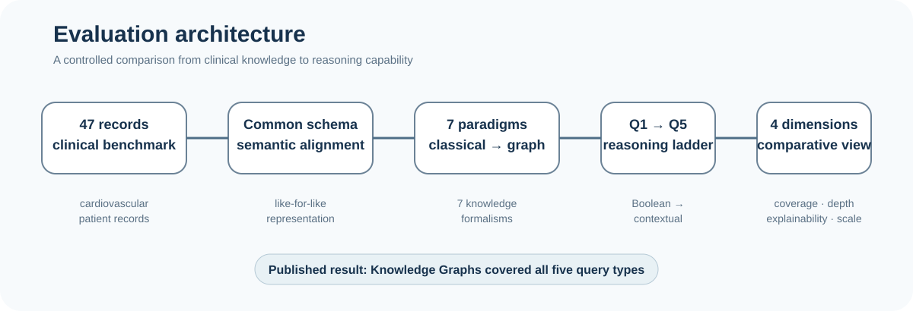

# Healthcare Knowledge Representation: Comparative Evaluation

[](https://doi.org/10.1007/978-3-032-24807-7_4)
[](https://doi.org/10.1007/978-3-032-24807-7_4)
[](#)
[](#)

> **Research companion to a comparative empirical study of knowledge-representation paradigms for healthcare question answering.**

<p align="center">
  
</p>

<p align="center">
  <em>
  From representation to reasoning: evaluating how the structure of knowledge
  shapes the questions an intelligent system can answer.
  </em>
</p>

---

## Research Snapshot

| | |
|---|---|
| **Domain** | Healthcare Question Answering |
| **Benchmark** | 47 curated cardiovascular patient records |
| **Queries** | 5 progressively complex clinical queries |
| **Paradigms** | 7 Knowledge Representation approaches |
| **Evaluation** | Semantic expressiveness · Query coverage · Explainability · Scalability |
| **Core reasoning concept** | Reasoning depth |
| **Publication** | Springer, 2026 |

---

## Overview

Healthcare Question Answering Systems require more than retrieving isolated facts. Clinical questions may involve logical conditions, quantified statements, relationships among patient attributes, interacting comorbidities, and contextual information.

This research investigates how the choice of **Knowledge Representation (KR)** paradigm influences the reasoning capability and answer quality of healthcare expert systems.

A common cardiovascular knowledge domain was used to compare:

**Propositional Logic · First-Order Predicate Logic · Rule-Based Systems · Relational Databases · Frame-Based Models · Ontologies · Knowledge Graphs**

The experimental benchmark consists of **47 curated patient records** and **five clinical queries (Q1–Q5)** designed to progress from simple Boolean reasoning toward quantified, relational, multi-relational, and contextual reasoning.

The study was published in the proceedings of the **2026 Computing Conference** by Springer.

### Publication

**Tripathi, Atul Kumar; Thakre, Puja Minodji; Chatterjee, Niladri.**

*Knowledge Representation for Healthcare Systems: A Comparative Analysis of Performance of Different Representation Paradigms*

*Intelligent Computing: Proceedings of the 2026 Computing Conference, Volume 2*

Lecture Notes in Networks and Information Systems, Vol. 1950, pp. 38–54, Springer, 2026.

**DOI:** [10.1007/978-3-032-24807-7_4](https://doi.org/10.1007/978-3-032-24807-7_4)

---

## Research Question

> **How does the choice of knowledge representation technique influence the reasoning performance and answer quality of expert systems in the healthcare domain?**

The study addresses this question through a common representation framework and a sequence of benchmark queries with increasing reasoning complexity.

---

## What Was Compared?

The study examines the progression from classical symbolic representations to graph-based knowledge representation.

| Paradigm | Representation idea |
|---|---|
| **Propositional Logic** | Atomic propositions and logical conditions |
| **First-Order Predicate Logic** | Variables, predicates, relations, and quantification |
| **Rule-Based Systems** | Explicit IF–THEN knowledge and inference rules |
| **Relational Databases** | Structured tabular representation queried through SQL |
| **Frame-Based Models** | Entities represented through slot–filler structures |
| **Ontologies** | Formal concepts, hierarchies, and semantic relationships |
| **Knowledge Graphs** | Entities and relations represented as interconnected graph structures |

The common domain schema was used to make the comparison as consistent as possible across the representation paradigms.

---

## Evaluation Framework

The evaluation considers four major dimensions:

| Dimension | What it examines |
|---|---|
| **Semantic Expressiveness** | Ability to represent hierarchical, relational, and contextual knowledge |
| **Query Coverage** | Which benchmark queries can be successfully answered |
| **Explainability** | Transparency of reasoning and availability of interpretable traces |
| **Scalability** | Ability to accommodate larger datasets and increasingly complex reasoning tasks |

### Reasoning Depth

Reasoning depth measures the number of inferential steps required to derive an answer.

For graph-based reasoning, the paper defines reasoning depth as the minimum path length among all valid reasoning paths supporting a query:

<p align="center">
  <strong><code>RD(q) = min<sub>p ∈ P(q)</sub> |p|</code></strong>
</p>

where `P(q)` denotes the set of valid reasoning paths supporting query `q`, and `|p|` denotes the path length.

Thus, direct fact retrieval corresponds to shallow reasoning, while answers requiring several connected inferential steps correspond to deeper reasoning.

---

## Benchmark Design

The benchmark uses **47 curated cardiovascular patient records** and five clinical queries designed to increase progressively in complexity.

### Q1 — Boolean

> **“Is a patient at risk of heart disease if chest pain is present and smoking history is negative?”**

**Reasoning type:** Boolean conditions

---

### Q2 — Universal

> **“Are all patients over 60 years old with hypertension at elevated risk of cardiovascular disease?”**

**Reasoning type:** Universal / quantified reasoning

---

### Q3 — Relational

> **“What are the cardiovascular risks for patients with both diabetes and obesity?”**

**Reasoning type:** Relational reasoning across patient attributes

---

### Q4 — Multi-relational

> **“Which treatment guidelines are applicable for diabetic patients with left ventricular hypertrophy and a history of atrial fibrillation?”**

**Reasoning type:** Multi-relational reasoning across comorbidities, patient history, and treatment guidance

---

### Q5 — Contextual

> **“Suggest interventions for patients with comorbidities similar to those reported in recent literature.”**

**Reasoning type:** Contextual reasoning and integration of heterogeneous knowledge

---

## Progressive Query Complexity

The benchmark intentionally follows the progression:

```text
Boolean
   ↓
Quantified
   ↓
Relational
   ↓
Multi-relational
   ↓
Contextual
